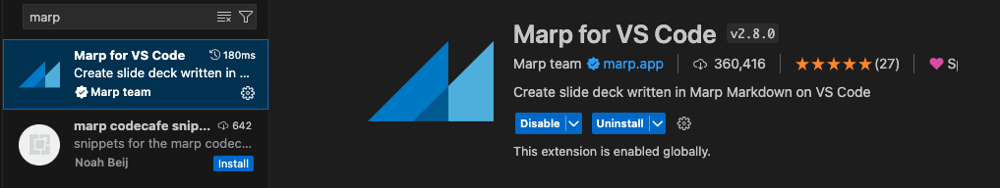

<br><br><br><br>

# Marpで発表スライドを作ろう

---
自己紹介

<br>

## せー
- フェンリル株式会社
- バックエンドメインのWebエンジニア
- 23卒

---
<br><br><br><br>

### スライドなにで作成していますか？

---

Marpとは

<br>

### Markdownドキュメントを記述することでスライドに変換できるツール

---
<br><br><br><br>

###  このスライドもMarpで作成しています

---
<br><br><br><br>

### 作り方(今回はVSCodeの拡張機能を利用します)

---
<br>

### 1. VSCodeの拡張機能を入れる

これです↓


---
<br>

### 2. 先頭に以下の記述をする
```
---
marp: true
---
```

---
<br><br><br><br>

## おわり！

---
<br><br><br><br>

### プレビュー表示するとスライド形式で表示されます

---
<br><br><br><br>

## その他にも

---
<br><br>

## テーマの変更
```
---
marp: true
theme: 
---
```

---
<br><br>

## ページ番号の追加
```
---
marp: true
paginate: true
---
```

---
<br><br>

## 自分でカスタマイズする

```
style: |
  section {
    background-color: gray;
    font-size: 40px;
  }
```

cssファイルとしても定義できます

---
<br><br>

### エクスポートする

`cmd + shift + p`でコマンドパレットを開いて`Marp: Export Slide Deck`を選択すると別ファイルとしてエクスポートできます

---
<br><br>

## 所感
- 軽い資料を作成するときはすごく便利
- gitで管理できる
- 凝った資料を作るのは大変
